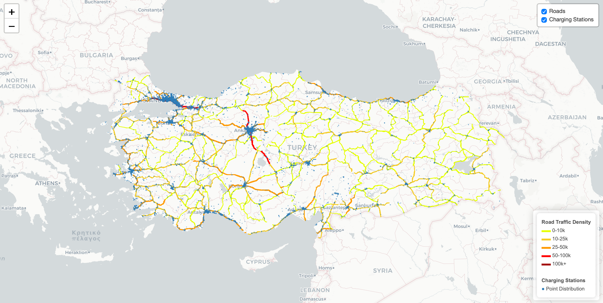

## Türkiye Electric Vehicle Charging Infrastructure

<<<<<<< HEAD
AAThis analysis presents a data-driven overview of Türkiye’s electric vehicle charging infrastructure. The study focuses on market growth, socket distribution, operator strategies, geographical concentration, and the spatial relationship between charging stations and highway traffic density.
=======
<<<<<<< Updated upstream
Öznur This analysis presents a data-driven overview of Türkiye’s electric vehicle charging infrastructure. The study focuses on market growth, socket distribution, operator strategies, geographical concentration, and the spatial relationship between charging stations and highway traffic density.
=======
This analysis presents a data-driven overview of Türkiye’s electric vehicle charging infrastructure. The study focuses on market growth, socket distribution, operator strategies, geographical concentration, and the spatial relationship between charging stations and highway traffic density.
>>>>>>> Stashed changes
>>>>>>> b60b074848b3cfde5fcb31e2c4761ae8bfd5b383

::: {.callout-note title="Key Market Indicators"}
| Indicator                 |    Value | Period     |
|---------------------------|---------:|------------|
| Total Sockets             |   41,767 | April 2026 |
| Electric Vehicles         |  408,314 | April 2026 |
| Monthly Charging Sessions |  2.62 Mn | March 2026 |
| Total Energy Consumption  | 67.5 GWh | March 2026 |
:::

## 1. Executive Summary

Türkiye’s electric vehicle charging infrastructure has entered a period of rapid and sustainable expansion. As of 23 April 2026, there are **408,314 registered electric vehicles** in the country. This figure increased from only **737 vehicles in 2016**, indicating a compound annual growth rate of over 80%. In parallel, the public charging network has expanded significantly and reached **41,767 sockets across 81 provinces** as of April 2026.

This analysis examines Türkiye’s charging market structure, competitive environment, geographical distribution, and the infrastructure strategies of leading operators. The main findings are summarized below:

-   The market remains fragmented, with a low level of concentration. The Herfindahl-Hirschman Index has consistently stayed below the 1,500 threshold, indicating healthy competition among more than 175 licensed operators.
-   ZES is the leading operator in terms of total socket count, while Trugo stands out in terms of energy volume with **13,526 MWh** in March 2026.
-   DC fast charging accounts for approximately **43%** of all sockets, showing the growing importance of fast-charging infrastructure.
-   İstanbul and Ankara together account for approximately **46%** of electricity consumption at charging stations, reflecting strong urban concentration.
-   Charging infrastructure is especially concentrated in western metropolitan areas and along major intercity highway corridors.

## 2. Market Overview

### 2.1 Growth of the Electric Vehicle Fleet

Türkiye’s electric vehicle fleet has shown exponential growth over the last decade. Starting from a very small base of **737 vehicles in 2016**, the total number increased to **373,733 by the end of 2025** and reached **408,314 as of 23 April 2026**. This represents an increase of approximately **35,000 vehicles in only four months**.

However, the number of electric vehicles and the number of charging sockets are not directly proportional across provinces. Some cities have high EV ownership and dense charging infrastructure, while others still show infrastructure gaps. Therefore, city level EV density should be analyzed together with socket availability, operator presence, and road traffic intensity.

```{r}
#| code-fold: true
#| code-summary: "Show the code"
#| warning: false
#| message: false


library(dplyr)
library(tidyverse)
library(sf)
library(leaflet)
library(rnaturalearth)
library(stringi)

df <- read.csv("NumofEV.csv", 
               header = TRUE, 
               sep = ";",
               encoding = "UTF-8")

tr_map <- ne_states(country = "Turkey", returnclass = "sf")

plot(st_geometry(tr_map))

df$City <- stri_trans_general(df$City, "latin-ascii")

tr_map$name <- stri_trans_general(tr_map$name, "latin-ascii")


df <- df %>%
  mutate(City = case_when(
    City == "Zonguldak" ~ "Zinguldak",
    City == "Kahramanmaras" ~ "K. Maras",
    City == "Kirikkale" ~ "Kinkkale",
    TRUE ~ City
  )) 

harita_veri <- left_join(tr_map, df, by = c("name" = "City"))

harita_veri <- harita_veri %>%
  mutate(EVcount_log = log10(EVcount + 1))

pal <- colorNumeric(palette = "YlOrRd", domain = harita_veri$EVcount_log, na.color = "transparent")

leaflet(harita_veri) %>%
  addProviderTiles(providers$CartoDB.Positron) %>% 
  addPolygons(
    fillColor = ~pal(EVcount_log),             
    weight = 1,                                  
    opacity = 1,
    color = "white",                             
    fillOpacity = 0.7,
    highlightOptions = highlightOptions(         
      weight = 3,
      color = "#666",
      fillOpacity = 0.9,
      bringToFront = TRUE),
    label = ~paste0(name, ": ", EVcount), 
    labelOptions = labelOptions(
      style = list("font-weight" = "normal", padding = "3px 8px"),
      textsize = "13px",
      direction = "auto")
  ) %>%
  addLegend(pal = pal, 
            values = ~EVcount_log,             
            opacity = 0.7, 
            title = "Number of Electric Vehicles",
            position = "bottomright",
            labFormat = labelFormat(transform = function(x) round(10^x - 1),
                                    big.mark = ",")
            )
```

Ömerin harita kodu gelecekk!!

<p style="text-align:center;"><strong>Figure 1:</strong> Number of Electric Vehicles (TÜİK, April 2026)</p>

The map shows that EV ownership is highly concentrated in western and metropolitan provinces, especially İstanbul, Ankara, İzmir, Antalya, Bursa, and Kocaeli. This pattern suggests that charging demand is closely related to urban population, income levels, and regional mobility patterns.

<br>

<p style="text-align:center;"><strong>Table 1:</strong> Top Provinces by Number of Electric Vehicles and Socket Counts</p>

| Province | EV Count | Socket Count |
|---|---:|---:|
| İstanbul | 152,046 | 13,484 |
| Ankara | 56,785 | 5,540 |
| İzmir | 31,909 | 1,790 |
| Antalya | 20,596 | 2,042 |
| Bursa | 19,676 | 1,900 |
| Kocaeli | 10,593 | 1,094 |

### 2.2 National Socket Inventory

As of 23 April 2026, the national charging network consists of **41,767 sockets** installed at charging points operated under EMRA licenses. Of these, **23,900 are AC sockets**, corresponding to **57%**, while **18,038 are DC sockets**, corresponding to **43%**. The network increased by **41%** in one year, rising from **29,496 sockets in April 2025**.

```{r}
#| label: Overall AC/DC Socket Distribution
#| code-fold: true
#| warning: false
#| message: false

# ============================================================
# EMU-430 Project — EV Charging Infrastructure, Turkey
# Script 01: Brand & City Analysis + ggplot2 Visualizations
# Author  : Azra Azizoğlu
# ============================================================

library(readxl) 
library(dplyr) 
library(tidyr) 
library(stringr) 
library(ggplot2) 
library(forcats) 
library(scales)

# ── COLOUR PALETTE ───────────────────────────────────────────
AC_COL <- "#4A90D9" 
DC_COL <- "#E84855" 
BRAND_COLS <- c("ZES" = "#E74C3C", "Trugo" = "#3498DB", "Voltrun" = "#2ECC71", "eŞarj" = "#F39C12", "Astor" = "#9B59B6")

# ── 1. LOAD & CLEAN ──────────────────────────────────────────
df_raw <- read_excel("sarj_istasyonlari_birlesik.xlsx")

df <- df_raw %>% 
  distinct(`Soket No`, .keep_all = TRUE) %>% 
  mutate(City = str_extract(Adres, "[^/]+$") %>% 
           str_trim() %>% 
           str_to_upper()) %>% 
  mutate(Brand = case_when( 
    Marka == "zes" ~ "ZES", 
    Marka == "Trugo" ~ "Trugo", 
    Marka == "VOLTRUN" ~ "Voltrun", 
    Marka == "eşarj" ~ "eŞarj", 
    Marka == "ASTOR" ~ "Astor", 
    TRUE ~ Marka ))

TOP5 <- c("ZES", "Trugo", "Voltrun", "eŞarj", "Astor") 
df5 <- df %>% 
  filter(Brand %in% TOP5) %>% 
  mutate(Brand = factor(Brand, levels = TOP5))

# ── 2. SUMMARY TABLE ─────────────────────────────────────────
summary_tbl <- df5 %>% 
  group_by(Brand) %>% 
  summarise( 
    Total = n(), 
    AC = sum(`Soket Tipi` == "AC"), 
    DC = sum(`Soket Tipi` == "DC"), 
    DC_pct = round(DC / Total * 100, 1), 
    Cities = n_distinct(City, na.rm = TRUE), 
    .groups = "drop" )
# PLOT 6
overall <- df %>% count(`Soket Tipi`) %>% mutate(pct = n / sum(n) * 100, label = paste0(`Soket Tipi`, "\n", round(pct, 1), "%\n(", comma(n), ")")) 
p6 <- ggplot(overall, aes(x = "", y = n, fill = `Soket Tipi`)) + geom_col(width = 1, colour ="white", linewidth = 1.5) + geom_text(aes(label = label), position = position_stack(vjust = 0.5), colour = "white", fontface = "bold", size = 5) + coord_polar("y") + scale_fill_manual(values = c("AC" = AC_COL, "DC" = DC_COL)) + labs(title = "Overall AC / DC Socket Distribution in Turkey", subtitle = paste0("Total: ", comma(sum(overall$n)), " sockets | Source: EPDK, April 2026"), fill = "Socket Type") + theme_void(base_size = 13) + theme(plot.title = element_text(face = "bold", hjust = 0.5), plot.subtitle = element_text(hjust = 0.5)) 
print(p6)
```


# 4. Route and Spatial Analysis

## 4.1 Highway Corridor Coverage

In this section, we analyze the spatial relationship between existing charging stations and road traffic density. The data was pre-processed to clean city names, validate geometries, and calculate the Average Annual Daily Traffic for various route segments.

```{r}
#| eval: false
#| label: meryem-analysis
#| code-fold: true
#| warning: false
#| message: false

# ============================================================
# 0. PACKAGES & INITIAL CONFIG
# ============================================================

options(timeout = 600)

library(sf)
if (Sys.info()[["sysname"]] == "Darwin") {
  Sys.setenv(PROJ_LIB = system.file("proj", package = "sf"))
}
library(readr)
library(readxl)
library(dplyr)
library(stringr)
library(stringi)
library(leaflet)
library(htmltools)
library(scales)
library(geodata)
library(terra)
library(lwgeom)

# ============================================================
# 1. RELATIVE FILE PATHS
# ============================================================
# MAKE SURE THESE FILES ARE UPLOADED TO THE REPOSITORY!
socket_path <- "enlemboylam.xlsx"
devlet_path <- "devlet_yollari_tek_satir_wkt.csv"
bolge_path  <- "tam_kapsamli_18_bolge_analizi.csv"
roads_excel_path <- "roads_D_yol_adi_eklendi.xlsx"

# ============================================================
# 2. HELPER FUNCTIONS
# ============================================================

find_col <- function(df, patterns) {
  nms <- names(df)
  nms_lower <- tolower(nms)
  for (p in patterns) {
    hit <- which(str_detect(nms_lower, p))
    if (length(hit) > 0) return(nms[hit[1]])
  }
  return(NA_character_)
}

to_num_tr <- function(x) {
  if (is.numeric(x)) return(x)
  x <- as.character(x)
  x <- str_replace_all(x, "\\.", "")
  x <- str_replace_all(x, ",", ".")
  suppressWarnings(as.numeric(x))
}

clean_kkno <- function(x) {
  x <- as.character(x)
  x <- str_trim(x)
  x <- str_replace_all(x, "\\s+", "")
  kk <- str_extract(x, "\\d{2,3}-\\d{1,2}")
  kk <- ifelse(!is.na(kk),
               paste0(str_extract(kk, "^\\d{2,3}"), "-", str_pad(str_extract(kk, "(?<=-)\\d{1,2}"), width = 2, pad = "0")),
               NA_character_)
  kk
}

clean_city <- function(x) {
  x <- as.character(x)
  x <- str_trim(x)
  x <- str_to_upper(x, locale = "tr")
  x <- stri_trans_general(x, "Latin-ASCII")
  x <- str_replace_all(x, "\\s+", " ")
  x
}

normalize_city_key <- function(x) {
  x <- clean_city(x)
  x <- case_when(
    x %in% c("AFYON", "AFYONKARAHISAR") ~ "AFYONKARAHISAR",
    x %in% c("ICEL", "MERSIN") ~ "MERSIN",
    x %in% c("KAHRAMANMARAS", "K MARAS", "K.MARAS") ~ "KAHRAMANMARAS",
    x %in% c("SANLIURFA", "S URFA", "S.URFA") ~ "SANLIURFA",
    TRUE ~ x
  )
  x
}

safe_make_valid <- function(x) {
  x <- st_make_valid(x)
  x <- st_collection_extract(x, "LINESTRING", warn = FALSE)
  x
}

# ============================================================
# 3. READ ALL CHARGING STATIONS (NO BRAND FILTER)
# ============================================================

socket_sheets <- excel_sheets(socket_path)
socket_raw <- lapply(socket_sheets, function(sh) {
  read_excel(socket_path, sheet = sh) %>% mutate(source_sheet = sh)
}) %>% bind_rows()

names(socket_raw) <- str_trim(names(socket_raw))
lon_col <- find_col(socket_raw, c("boylam", "longitude", "^lon$", "lng", "^x$"))
lat_col <- find_col(socket_raw, c("enlem", "latitude", "^lat$", "^y$"))

socket_clean <- socket_raw %>%
  mutate(lon = to_num_tr(.data[[lon_col]]), lat = to_num_tr(.data[[lat_col]])) %>%
  filter(!is.na(lon), !is.na(lat), lon >= 25, lon <= 46, lat >= 35, lat <= 43)

set.seed(42)
socket_clean <- socket_clean %>%
  mutate(
    lon_plot = lon + runif(n(), -0.005, 0.005),
    lat_plot = lat + runif(n(), -0.005, 0.005),
    popup = "<b>Charging Station</b>"
  )

# ============================================================
# 4. READ ROAD DENSITY DATA
# ============================================================

devlet_yogt_excel <- read_excel(roads_excel_path, sheet = "devlet_yolları")
kkno_col <- find_col(devlet_yogt_excel, c("^kkno$", "kkno"))
city_col_excel <- find_col(devlet_yogt_excel, c("^ili$", "^il$", "şehir", "sehir"))
oto_yogt_col <- find_col(devlet_yogt_excel, c("otomobil"))

road_car_density_city <- devlet_yogt_excel %>%
  mutate(kkno_key = clean_kkno(.data[[kkno_col]]),
         city_key = normalize_city_key(.data[[city_col_excel]]),
         car_aadt = to_num_tr(.data[[oto_yogt_col]])) %>%
  filter(!is.na(kkno_key), !is.na(city_key), !is.na(car_aadt)) %>%
  group_by(kkno_key, city_key) %>%
  summarise(car_aadt_avg = mean(car_aadt, na.rm = TRUE), .groups = "drop")

# ============================================================
# 5. READ GEOMETRIES
# ============================================================

devlet_csv <- read_csv(devlet_path, locale = locale(encoding = "UTF-8"), show_col_types = FALSE)
devlet_csv$kkno_raw <- if("KKNO" %in% names(devlet_csv)) as.character(devlet_csv$KKNO) else as.character(devlet_csv$kkno)
devlet_wkt_col <- if ("WKT_LINESTRING" %in% names(devlet_csv)) "WKT_LINESTRING" else "geometry"

devlet_sf <- devlet_csv %>%
  filter(!is.na(.data[[devlet_wkt_col]]), str_detect(.data[[devlet_wkt_col]], "LINESTRING")) %>%
  mutate(kkno_key = clean_kkno(kkno_raw), WKT_ROUTE = as.character(.data[[devlet_wkt_col]])) %>%
  filter(!is.na(kkno_key)) %>%
  st_as_sf(wkt = "WKT_ROUTE", crs = 4326) %>% safe_make_valid()

bolge_csv <- read_csv(bolge_path, locale = locale(encoding = "UTF-8"), show_col_types = FALSE)
bolge_csv$kkno_raw <- if("kkno" %in% names(bolge_csv)) as.character(bolge_csv$kkno) else as.character(bolge_csv$KKNO)
bolge_geom_col <- if ("geometry" %in% names(bolge_csv)) "geometry" else "WKT_LINESTRING"

bolge_sf <- bolge_csv %>%
  filter(!is.na(.data[[bolge_geom_col]]), str_detect(.data[[bolge_geom_col]], "LINESTRING")) %>%
  mutate(kkno_key = clean_kkno(kkno_raw), WKT_ROUTE = as.character(.data[[bolge_geom_col]])) %>%
  filter(!is.na(kkno_key)) %>%
  st_as_sf(wkt = "WKT_ROUTE", crs = 4326) %>% safe_make_valid()

# ============================================================
# 7. COMBINE & SPLIT BY PROVINCE
# ============================================================

routes_raw_sf <- bind_rows(devlet_sf %>% select(kkno_key), bolge_sf %>% select(kkno_key))
routes_raw_sf <- routes_raw_sf[!st_is_empty(routes_raw_sf), ]

# NOTE: gadm path requires caching, it will be downloaded if it does not exist locally.
tur_adm1 <- geodata::gadm(country = "TUR", level = 1, path = tempdir())
tur_provinces <- st_as_sf(tur_adm1) %>% st_transform(4326) %>%
  mutate(city_key = normalize_city_key(NAME_1)) %>% select(city_key, geometry) %>% st_make_valid()

routes_by_city <- suppressWarnings(st_intersection(st_transform(routes_raw_sf, 3857), st_transform(tur_provinces, 3857))) %>%
  st_collection_extract("LINESTRING") %>% st_transform(4326)

# ============================================================
# 10. DENSITY CALCULATION & STYLING
# ============================================================

routes_density_sf <- routes_by_city %>%
  left_join(road_car_density_city, by = c("kkno_key", "city_key")) %>%
  filter(!is.na(car_aadt_avg)) %>%
  mutate(
    density_class = cut(car_aadt_avg, breaks = c(0, 10000, 25000, 50000, 100000, Inf),
                        labels = c("0 - 10.000", "10.000 - 25.000", "25.000 - 50.000", "50.000 - 100.000", "100.000+"), include.lowest = TRUE),
    route_weight = case_when(
      density_class == "0 - 10.000" ~ 1.2, density_class == "10.000 - 25.000" ~ 1.5,
      density_class == "25.000 - 50.000" ~ 1.9, density_class == "50.000 - 100.000" ~ 2.3,
      density_class == "100.000+" ~ 2.8, TRUE ~ 1.5
    )
  )
routes_density_sf <- st_simplify(routes_density_sf, preserveTopology = TRUE, dTolerance = 0.001)

route_palette <- c("0 - 10.000"="#E6FF05", "10.000 - 25.000"="#F5CC27", "25.000 - 50.000"="#FF9B05", "50.000 - 100.000"="#FF0000", "100.000+"="#A30500")

# ============================================================
# 14. LEAFLET MAP (POINT BASED - ROAD VISIBILITY FOCUSED)
# ============================================================

legend_html <- HTML("<div style='background:white;padding:10px;border-radius:6px;box-shadow:0 0 8px rgba(0,0,0,0.2);font-size:11px;'>
                    <b>Road Traffic Density</b><br>
                    <span style='background:#E6FF05;width:20px;height:4px;display:inline-block;'></span> 0-10k<br>
                    <span style='background:#F5CC27;width:20px;height:4px;display:inline-block;'></span> 10-25k<br>
                    <span style='background:#FF9B05;width:20px;height:4px;display:inline-block;'></span> 25-50k<br>
                    <span style='background:#FF0000;width:20px;height:4px;display:inline-block;'></span> 50-100k<br>
                    <span style='background:#A30500;width:20px;height:4px;display:inline-block;'></span> 100k+<br><br>
                    <b>Charging Stations</b><br>
                    <span style='color:#2c7bb6;'>●</span> Point Distribution</div>")

m <- leaflet(options = leafletOptions(preferCanvas = TRUE)) %>%
  addProviderTiles(providers$CartoDB.Positron) %>%
  setView(lng = 35.2, lat = 39.0, zoom = 6)

# Yollar
density_order <- levels(routes_density_sf$density_class)
for (cls in density_order) {
  temp <- routes_density_sf %>% filter(density_class == cls)
  if (nrow(temp) > 0) {
    m <- m %>% addPolylines(data = temp, color = route_palette[[cls]], weight = ~route_weight, opacity = 0.85, group = "Roads")
  }
}

# Istasyonlar
m <- m %>% addCircleMarkers(
  data = socket_clean, lng = ~lon_plot, lat = ~lat_plot,
  radius = 1,
  stroke = FALSE, 
  fillColor = "#2c7bb6",
  fillOpacity = 0.5,
  group = "Charging Stations"
) %>%
  addLayersControl(overlayGroups = c("Roads", "Charging Stations"), options = layersControlOptions(collapsed = FALSE)) %>%
  addControl(legend_html, position = "bottomright")
```


<<<<<<< HEAD
=======
<<<<<<< Updated upstream
=======
>>>>>>> b60b074848b3cfde5fcb31e2c4761ae8bfd5b383

```{r}
#| label: brand-analysis
#| code-fold: true
#| warning: false
#| message: false

# ============================================================
# EMU-430 Project — EV Charging Infrastructure, Turkey
# Script 01: Brand & City Analysis + ggplot2 Visualizations
# Author  : Azra Azizoğlu
# ============================================================

library(readxl) 
library(dplyr) 
library(tidyr) 
library(stringr) 
library(ggplot2) 
library(forcats) 
library(scales)

# ── COLOUR PALETTE ───────────────────────────────────────────
AC_COL <- "#4A90D9" 
DC_COL <- "#E84855" 
BRAND_COLS <- c("ZES" = "#E74C3C", "Trugo" = "#3498DB", "Voltrun" = "#2ECC71", "eŞarj" = "#F39C12", "Astor" = "#9B59B6")

# ── 1. LOAD & CLEAN ──────────────────────────────────────────
df_raw <- read_excel("sarj_istasyonlari_birlesik.xlsx")

df <- df_raw %>% 
  distinct(`Soket No`, .keep_all = TRUE) %>% 
  mutate(City = str_extract(Adres, "[^/]+$") %>% 
           str_trim() %>% 
           str_to_upper()) %>% 
  mutate(Brand = case_when( 
    Marka == "zes" ~ "ZES", 
    Marka == "Trugo" ~ "Trugo", 
    Marka == "VOLTRUN" ~ "Voltrun", 
    Marka == "eşarj" ~ "eŞarj", 
    Marka == "ASTOR" ~ "Astor", 
    TRUE ~ Marka ))

TOP5 <- c("ZES", "Trugo", "Voltrun", "eŞarj", "Astor") 
df5 <- df %>% 
  filter(Brand %in% TOP5) %>% 
  mutate(Brand = factor(Brand, levels = TOP5))

# ── 2. SUMMARY TABLE ─────────────────────────────────────────
summary_tbl <- df5 %>% 
  group_by(Brand) %>% 
  summarise( 
    Total = n(), 
    AC = sum(`Soket Tipi` == "AC"), 
    DC = sum(`Soket Tipi` == "DC"), 
    DC_pct = round(DC / Total * 100, 1), 
    Cities = n_distinct(City, na.rm = TRUE), 
    .groups = "drop" )

# ── PLOTS ────────────────────────────────────────────────────

# PLOT 1
p1 <- summary_tbl %>% mutate(Brand = fct_reorder(Brand, Total)) %>% ggplot(aes(x = Brand, y = Total, fill = Brand)) + geom_col(width = 0.6, show.legend = FALSE) + geom_text(aes(label = comma(Total)), vjust = -0.5, fontface = "bold", size = 4) + scale_fill_manual(values = BRAND_COLS) + scale_y_continuous(labels = comma, expand = expansion(mult = c(0, 0.15))) + labs(title = "Total Number of Sockets by Brand (Top 5)", subtitle = "Source: EPDK Charging Station Registry, April 2026", x = NULL, y = "Number of Sockets") + theme_minimal(base_size = 13) + theme(plot.title = element_text(face = "bold"), panel.grid.major.x = element_blank()) 
print(p1)

# PLOT 2
p2 <- df5 %>% count(Brand, `Soket Tipi`) %>% ggplot(aes(x = Brand, y = n, fill = `Soket Tipi`)) + geom_col(position = position_dodge(width = 0.7), width = 0.65) + geom_text(aes(label = comma(n)), position = position_dodge(width = 0.7), vjust = -0.4, fontface = "bold", size = 3.5) + scale_fill_manual(values = c("AC" = AC_COL, "DC" = DC_COL), name = "Socket Type") + scale_y_continuous(labels = comma, expand = expansion(mult = c(0, 0.15))) + labs(title = "AC vs DC Socket Distribution (Top 5 Brands)", subtitle = "Source: EPDK Charging Station Registry, April 2026", x = NULL, y = "Number of Sockets") + theme_minimal(base_size = 13) + theme(plot.title = element_text(face = "bold"), panel.grid.major.x = element_blank()) 
print(p2)

# PLOT 3
p3 <- summary_tbl %>% mutate(Brand = fct_reorder(Brand, DC_pct), Strategy = ifelse(DC_pct >= 50, "DC-dominant (fast charging)", "AC-dominant")) %>% ggplot(aes(x = Brand, y = DC_pct, fill = Strategy)) + geom_col(width = 0.6) + geom_text(aes(label = paste0(DC_pct, "%")), vjust = -0.5, fontface = "bold", size = 4) + geom_hline(yintercept = 50, linetype = "dashed", colour = "#555555") + annotate("text", x = 5.4, y = 52.5, label = "50% threshold", size = 3.5, colour = "#555555", hjust = 1) + scale_fill_manual(values = c("DC-dominant (fast charging)" = DC_COL, "AC-dominant" = AC_COL), name = "Strategy") + scale_y_continuous(limits = c(0, 110), labels = function(x) paste0(x, "%")) + labs(title = "DC Socket Ratio by Brand — Charging Strategy", subtitle = "Source: EPDK Charging Station Registry, April 2026", x = NULL, y = "DC Socket Ratio (%)") + theme_minimal(base_size = 13) + theme(plot.title = element_text(face = "bold"), panel.grid.major.x = element_blank()) 
print(p3)

# PLOT 4
city_data <- df5 %>% count(Brand, City) %>% group_by(Brand) %>% slice_max(n, n = 8) %>% mutate(City = fct_reorder(City, n)) 
p4 <- ggplot(city_data, aes(x = n, y = City, fill = Brand)) + geom_col(show.legend = FALSE) + geom_text(aes(label = n), hjust = -0.2, size = 3) + scale_fill_manual(values = BRAND_COLS) + scale_x_continuous(expand = expansion(mult = c(0, 0.2))) + facet_wrap(~Brand, scales = "free", nrow = 1) + labs(title = "Top 5 Brands — Socket Distribution by City (Top 8 Cities Each)", subtitle = "Source: EPDK Charging Station Registry, April 2026", x = "Number of Sockets", y = NULL) + theme_minimal(base_size = 11) + theme(plot.title = element_text(face = "bold"), strip.text = element_text(face = "bold", size = 11), panel.grid.major.y = element_blank()) 
print(p4)

# PLOT 5
p5 <- summary_tbl %>% mutate(Brand = fct_reorder(Brand, Cities)) %>% ggplot(aes(x = Brand, y = Cities, fill = Brand)) + geom_col(width = 0.6, show.legend = FALSE) + geom_text(aes(label = paste(Cities, "cities")), vjust = -0.5, fontface = "bold", size = 4) + scale_fill_manual(values = BRAND_COLS) + scale_y_continuous(expand = expansion(mult = c(0, 0.18))) + labs(title = "Geographic Coverage — Number of Cities per Brand (Top 5)", subtitle = "Source: EPDK Charging Station Registry, April 2026", x = NULL, y = "Number of Cities") + theme_minimal(base_size = 13) + theme(plot.title = element_text(face = "bold"), panel.grid.major.x = element_blank()) 
print(p5)

# PLOT 6
overall <- df %>% count(`Soket Tipi`) %>% mutate(pct = n / sum(n) * 100, label = paste0(`Soket Tipi`, "\n", round(pct, 1), "%\n(", comma(n), ")")) 
p6 <- ggplot(overall, aes(x = "", y = n, fill = `Soket Tipi`)) + geom_col(width = 1, colour ="white", linewidth = 1.5) + geom_text(aes(label = label), position = position_stack(vjust = 0.5), colour = "white", fontface = "bold", size = 5) + coord_polar("y") + scale_fill_manual(values = c("AC" = AC_COL, "DC" = DC_COL)) + labs(title = "Overall AC / DC Socket Distribution in Turkey", subtitle = paste0("Total: ", comma(sum(overall$n)), " sockets | Source: EPDK, April 2026"), fill = "Socket Type") + theme_void(base_size = 13) + theme(plot.title = element_text(face = "bold", hjust = 0.5), plot.subtitle = element_text(hjust = 0.5)) 
print(p6)

# PLOT 7
city_top20 <- df %>% filter(!is.na(City)) %>% count(City, name = "Sockets") %>% slice_max(Sockets, n = 20) %>% mutate(City = fct_reorder(City, Sockets)) 
p7 <- ggplot(city_top20, aes(x = Sockets, y = City)) + geom_col(fill = "#1565C0", width = 0.7) + geom_text(aes(label = comma(Sockets)), hjust = -0.15, size = 3.5, fontface = "bold") + scale_x_continuous(labels = comma, expand = expansion(mult = c(0, 0.15))) + labs(title = "Socket Density by City — Top 20", subtitle = "All brands and socket types | Source: EPDK, April 2026", x = "Number of Sockets", y = NULL) + theme_minimal(base_size = 12) + theme(plot.title = element_text(face = "bold"), panel.grid.major.y = element_blank()) 
print(p7)
```
<<<<<<< HEAD
=======
>>>>>>> Stashed changes
>>>>>>> b60b074848b3cfde5fcb31e2c4761ae8bfd5b383
