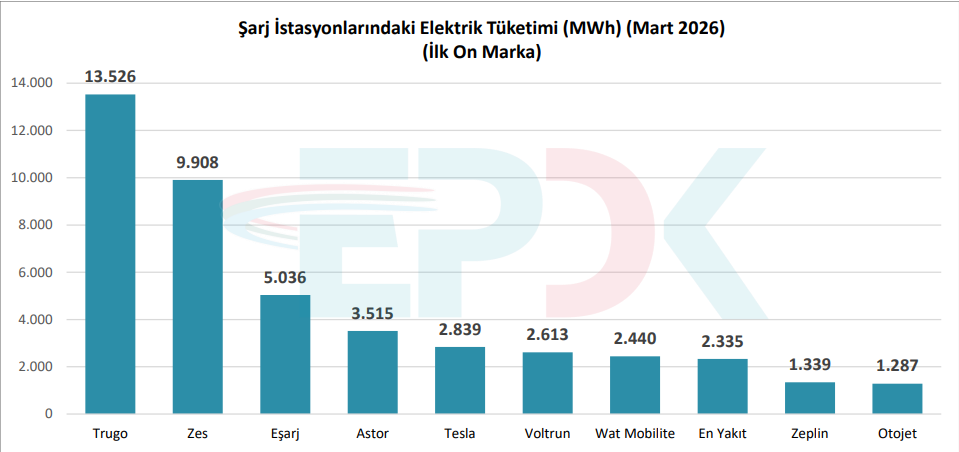

## Öznur Türkiye Electric Vehicle Charging Infrastructure


This analysis presents a data-driven overview of Türkiye’s electric vehicle charging infrastructure. The study focuses on market growth, socket distribution, operator strategies, geographical concentration, and the spatial relationship between charging stations and highway traffic density.

::: {.callout-note title="Key Market Indicators"}
| Indicator                 |    Value | Period     |
|---------------------------|---------:|------------|
| Total Sockets             |   41,767 | April 2026 |
| Electric Vehicles         |  408,314 | April 2026 |
| Monthly Charging Sessions |  2.62 Mn | March 2026 |
| Total Energy Consumption  | 67.5 GWh | March 2026 |
:::

## 1. Executive Summary

Türkiye’s electric vehicle charging infrastructure has entered a period of rapid and sustainable expansion. As of 23 April 2026, there are **408,314 registered electric vehicles** in the country. This figure increased from only **737 vehicles in 2016**, indicating a compound annual growth rate of over 80%. In parallel, the public charging network has expanded significantly and reached **41,767 sockets across 81 provinces** as of April 2026.

This analysis examines Türkiye’s charging market structure, competitive environment, geographical distribution, and the infrastructure strategies of leading operators. The main findings are summarized below:

-   The market remains fragmented, with a low level of concentration. The Herfindahl-Hirschman Index has consistently stayed below the 1,500 threshold, indicating healthy competition among more than 175 licensed operators.
-   ZES is the leading operator in terms of total socket count, while Trugo stands out in terms of energy volume with **13,526 MWh** in March 2026.
-   DC fast charging accounts for approximately **43%** of all sockets, showing the growing importance of fast-charging infrastructure.
-   İstanbul and Ankara together account for approximately **46%** of electricity consumption at charging stations, reflecting strong urban concentration.
-   Charging infrastructure is especially concentrated in western metropolitan areas and along major intercity highway corridors.

## 2. Market Overview

### 2.1 Growth of the Electric Vehicle Fleet

Türkiye’s electric vehicle fleet has shown exponential growth over the last decade. Starting from a very small base of **737 vehicles in 2016**, the total number increased to **373,733 by the end of 2025** and reached **408,314 as of 23 April 2026**. This represents an increase of approximately **35,000 vehicles in only four months**.

However, the number of electric vehicles and the number of charging sockets are not directly proportional across provinces. Some cities have high EV ownership and dense charging infrastructure, while others still show infrastructure gaps. Therefore, city level EV density should be analyzed together with socket availability, operator presence, and road traffic intensity.

```{r}
#| code-fold: true
#| code-summary: "Show the code"
#| warning: false
#| message: false


library(dplyr)
library(tidyverse)
library(sf)
library(leaflet)
library(rnaturalearth)
library(stringi)

df <- read.csv("NumofEV.csv", 
               header = TRUE, 
               sep = ";",
               encoding = "UTF-8")

tr_map <- ne_states(country = "Turkey", returnclass = "sf")

plot(st_geometry(tr_map))

df$City <- stri_trans_general(df$City, "latin-ascii")

tr_map$name <- stri_trans_general(tr_map$name, "latin-ascii")


df <- df %>%
  mutate(City = case_when(
    City == "Zonguldak" ~ "Zinguldak",
    City == "Kahramanmaras" ~ "K. Maras",
    City == "Kirikkale" ~ "Kinkkale",
    TRUE ~ City
  )) 

harita_veri <- left_join(tr_map, df, by = c("name" = "City"))

harita_veri <- harita_veri %>%
  mutate(EVcount_log = log10(EVcount + 1))

pal <- colorNumeric(palette = "YlOrRd", domain = harita_veri$EVcount_log, na.color = "transparent")

leaflet(harita_veri) %>%
  addProviderTiles(providers$CartoDB.Positron) %>% 
  addPolygons(
    fillColor = ~pal(EVcount_log),             
    weight = 1,                                  
    opacity = 1,
    color = "white",                             
    fillOpacity = 0.7,
    highlightOptions = highlightOptions(         
      weight = 3,
      color = "#666",
      fillOpacity = 0.9,
      bringToFront = TRUE),
    label = ~paste0(name, ": ", EVcount), 
    labelOptions = labelOptions(
      style = list("font-weight" = "normal", padding = "3px 8px"),
      textsize = "13px",
      direction = "auto")
  ) %>%
  addLegend(pal = pal, 
            values = ~EVcount_log,             
            opacity = 0.7, 
            title = "Number of Electric Vehicles",
            position = "bottomright",
            labFormat = labelFormat(transform = function(x) round(10^x - 1),
                                    big.mark = ",")
            )
```


```{r}
#| label: omer-interactive-map
#| code-fold: true
#| warning: false
#| message: false

# 1. Gerekli Kütüphaneler
library(readxl)
library(leaflet)
library(dplyr)

# 2. Dosyayı Repodan Okuma (file.choose() iptal edildi, doğrudan repo yolu verildi)
veri <- read_excel("soketenlemboylam.xlsx")

# 3. Veriyi Düzenleme (Enlem, Boylam ve AC/DC Sütunlarını Belirleme)
veri <- veri %>%
  mutate(
    Enlem_E = as.numeric(.[[5]]), 
    Boylam_F = as.numeric(.[[6]]), 
    Tip_H = trimws(as.character(.[[8]]))   # Boşluk hatalarını engellemek için trimws() eklendi
  ) %>%
  filter(!is.na(Enlem_E) & !is.na(Boylam_F)) 

# 4. Renk Paletini Tanımlama
renk_paleti <- colorFactor(palette = c("blue", "red"), domain = c("AC", "DC"))

# 5. Haritayı Oluşturma (Jitter Yöntemi ile)
harita <- leaflet(data = veri) %>%
  addTiles() %>% 
  addCircleMarkers(
    # jitter() fonksiyonu ile noktaları hafifçe dağıtıyoruz
    lat = ~jitter(Enlem_E, amount = 0.00015), 
    lng = ~jitter(Boylam_F, amount = 0.00015), 
    
    color = ~renk_paleti(Tip_H),     
    radius = 3,                      # Noktalar yan yana dizileceği için yarıçap 3
    fillOpacity = 0.7,               # Kesişen yerler belli olsun diye saydamlık
    stroke = FALSE,                  
    popup = ~paste("<b>Şarj Tipi:</b>", Tip_H) # Tıklayınca AC/DC bilgisini verir
  ) %>%
  addLegend(
    position = "bottomright", 
    pal = renk_paleti, 
    values = ~Tip_H, 
    title = "İstasyon Tipi",
    opacity = 1
  )

# 6. Haritayı Ekrana Yansıtma
harita
```

<p style="text-align:center;"><strong>Figure 1:</strong> Number of Electric Vehicles (TÜİK, April 2026)</p>

The map shows that EV ownership is highly concentrated in western and metropolitan provinces, especially İstanbul, Ankara, İzmir, Antalya, Bursa, and Kocaeli. This pattern suggests that charging demand is closely related to urban population, income levels, and regional mobility patterns.

<br>

<p style="text-align:center;"><strong>Table 1:</strong> Top Provinces by Number of Electric Vehicles and Socket Counts</p>

| Province | EV Count | Socket Count |
|---|---:|---:|
| İstanbul | 152,046 | 13,484 |
| Ankara | 56,785 | 5,540 |
| İzmir | 31,909 | 1,790 |
| Antalya | 20,596 | 2,042 |
| Bursa | 19,676 | 1,900 |
| Kocaeli | 10,593 | 1,094 |

### 2.2 National Socket Inventory

As of 23 April 2026, the national charging network consists of **41,767 sockets** installed at charging points operated under EMRA licenses. Of these, **23,900 are AC sockets**, corresponding to **57%**, while **18,038 are DC sockets**, corresponding to **43%**. The network increased by **41%** in one year, rising from **29,496 sockets in April 2025**.

```{r}
#| label: Overall AC/DC Socket Distribution
#| code-fold: true
#| warning: false
#| message: false

# ============================================================
# EMU-430 Project — EV Charging Infrastructure, Turkey
# Script 01: Brand & City Analysis + ggplot2 Visualizations
# Author  : Azra Azizoğlu
# ============================================================

library(readxl) 
library(dplyr) 
library(tidyr) 
library(stringr) 
library(ggplot2) 
library(forcats) 
library(scales)

# ── COLOUR PALETTE ───────────────────────────────────────────
AC_COL <- "#4A90D9" 
DC_COL <- "#E84855" 
BRAND_COLS <- c("ZES" = "#E74C3C", "Trugo" = "#3498DB", "Voltrun" = "#2ECC71", "eŞarj" = "#F39C12", "Astor" = "#9B59B6")

# ── 1. LOAD & CLEAN ──────────────────────────────────────────
df_raw <- read_excel("sarj_istasyonlari_birlesik.xlsx")

df <- df_raw %>% 
  distinct(`Soket No`, .keep_all = TRUE) %>% 
  mutate(City = str_extract(Adres, "[^/]+$") %>% 
           str_trim() %>% 
           str_to_upper()) %>% 
  mutate(Brand = case_when( 
    Marka == "zes" ~ "ZES", 
    Marka == "Trugo" ~ "Trugo", 
    Marka == "VOLTRUN" ~ "Voltrun", 
    Marka == "eşarj" ~ "eŞarj", 
    Marka == "ASTOR" ~ "Astor", 
    TRUE ~ Marka ))

TOP5 <- c("ZES", "Trugo", "Voltrun", "eŞarj", "Astor") 
df5 <- df %>% 
  filter(Brand %in% TOP5) %>% 
  mutate(Brand = factor(Brand, levels = TOP5))

# ── 2. SUMMARY TABLE ─────────────────────────────────────────
summary_tbl <- df5 %>% 
  group_by(Brand) %>% 
  summarise( 
    Total = n(), 
    AC = sum(`Soket Tipi` == "AC"), 
    DC = sum(`Soket Tipi` == "DC"), 
    DC_pct = round(DC / Total * 100, 1), 
    Cities = n_distinct(City, na.rm = TRUE), 
    .groups = "drop" )
# PLOT 6
overall <- df %>% count(`Soket Tipi`) %>% mutate(pct = n / sum(n) * 100, label = paste0(`Soket Tipi`, "\n", round(pct, 1), "%\n(", comma(n), ")")) 
p6 <- ggplot(overall, aes(x = "", y = n, fill = `Soket Tipi`)) + geom_col(width = 1, colour ="white", linewidth = 1.5) + geom_text(aes(label = label), position = position_stack(vjust = 0.5), colour = "white", fontface = "bold", size = 5) + coord_polar("y") + scale_fill_manual(values = c("AC" = AC_COL, "DC" = DC_COL)) + labs(title = "Overall AC / DC Socket Distribution in Turkey", subtitle = paste0("Total: ", comma(sum(overall$n)), " sockets | Source: EPDK, April 2026"), fill = "Socket Type") + theme_void(base_size = 13) + theme(plot.title = element_text(face = "bold", hjust = 0.5), plot.subtitle = element_text(hjust = 0.5)) 
print(p6)
```
<p style="text-align:center;"><strong>Figure 3:</strong> Overall AC/DC Socket Distribution in Türkiye (EMRA, April 2026)</p>

Although AC sockets continue to form the majority with a share of **56%**, the share of DC fast-charging infrastructure is remarkably high compared to many European markets. This reflects Türkiye’s long intercity travel distances and the strategic positioning of highway fast-charging networks by major operators.

### 2.3 Geographical Concentration

İstanbul holds a dominant position in the national socket structure with **13,484 sockets**, representing **32.3%** of the total. It is followed by Ankara with **5,540 sockets**, corresponding to **13.3%**. The top five cities (İstanbul, Ankara, Antalya, Bursa, and İzmir) account for approximately **58%** of all installed sockets. After the top five, socket density decreases rapidly, indicating ongoing infrastructure gaps in smaller cities.

```{r}
#| label: fig-city-socket-density
#| code-fold: true
#| code-summary: "Show the code"
#| warning: false
#| message: false
# PLOT 7
city_top20 <- df %>% filter(!is.na(City)) %>% count(City, name = "Sockets") %>% slice_max(Sockets, n = 20) %>% mutate(City = fct_reorder(City, Sockets)) 
p7 <- ggplot(city_top20, aes(x = Sockets, y = City)) + geom_col(fill = "#1565C0", width = 0.7) + geom_text(aes(label = comma(Sockets)), hjust = -0.15, size = 3.5, fontface = "bold") + scale_x_continuous(labels = comma, expand = expansion(mult = c(0, 0.15))) + labs(title = "Socket Density by City — Top 20", subtitle = "All brands and socket types | Source: EPDK, April 2026", x = "Number of Sockets", y = NULL) + theme_minimal(base_size = 12) + theme(plot.title = element_text(face = "bold"), panel.grid.major.y = element_blank()) 
print(p7)

```
<p style="text-align:center;"><strong>Figure 4:</strong> Socket Density by City — Top 20 Cities (EMRA, April 2026)</p>

```{r}
#| label: omer-heatmap
#| code-fold: true
#| code-summary: "Show the heatmap code"
#| warning: false
#| message: false

# 1. Gerekli Kütüphaneler
library(readxl)
library(leaflet)
library(leaflet.extras) # Isı haritası için kritik paket
library(dplyr)

# 2. Dosyayı Okuma (Yerel klasörden doğrudan okuma)
veri <- read_excel("soketenlemboylam.xlsx")

# 3. Veriyi Düzenleme (Enlem ve Boylam sütunları belirleniyor)
isi_verisi <- veri %>%
  mutate(
    Enlem_E = as.numeric(.[[5]]), 
    Boylam_F = as.numeric(.[[6]])
  ) %>%
  filter(!is.na(Enlem_E) & !is.na(Boylam_F)) 

# 4. Isı Haritasını Oluşturma
harita_isi <- leaflet(data = isi_verisi) %>%
  addTiles() %>% # Standart harita arka planı
  setView(lng = 35.2, lat = 39.0, zoom = 6) %>% # Türkiye odaklı başlatma
  addHeatmap(
    lat = ~Enlem_E, 
    lng = ~Boylam_F, 
    blur = 20,       # Renklerin birbirine geçiş yumuşaklığı
    max = 0.05,      # Yoğunluk tavan noktası
    radius = 15      # Isı noktalarının yayılma genişliği
  )

# 5. Haritayı Ekrana Yansıtma
harita_isi
```
<p style="text-align:center;"><strong>Figure 5:</strong> Charging Station Density Heat Map Across Türkiye (EMRA, April 2026)</p>

## 3. Competitive Environment

### 3.1 Market Structure

Türkiye’s EV charging market is characterized by low concentration and active competition. The Herfindahl-Hirschman Index (HHI), calculated based on total socket share, has remained below the **1,500 threshold** since mid-2024 and stayed within the **low concentration** range as of March 2026.

This pattern applies to both the AC and DC submarkets. There are more than **175 licensed charging network operators** in the market, and no single player controls more than **13%** of total sockets.

### 3.2 Top 5 Operators — Socket Inventory

The five largest operators by socket count — **ZES, Trugo, Voltrun, Eşarj, and Astor** — together account for approximately **33%** of the national total. ZES leads with **4,859 sockets**, followed by Trugo with **3,485**, Voltrun with **2,393**, Eşarj with **2,152**, and Astor with **906**.

```{r}
#| label: fig-socket-brand
#| code-fold: true
#| code-summary: "Show the code"
#| warning: false
#| message: false
# PLOT 1
p1 <- summary_tbl %>% mutate(Brand = fct_reorder(Brand, Total)) %>% ggplot(aes(x = Brand, y = Total, fill = Brand)) + geom_col(width = 0.6, show.legend = FALSE) + geom_text(aes(label = comma(Total)), vjust = -0.5, fontface = "bold", size = 4) + scale_fill_manual(values = BRAND_COLS) + scale_y_continuous(labels = comma, expand = expansion(mult = c(0, 0.15))) + labs(title = "Total Number of Sockets by Brand (Top 5)", subtitle = "Source: EPDK Charging Station Registry, April 2026", x = NULL, y = "Number of Sockets") + theme_minimal(base_size = 13) + theme(plot.title = element_text(face = "bold"), panel.grid.major.x = element_blank()) 
print(p1)

```
<p style="text-align:center;"><strong>Figure 6:</strong> Total Socket Count by Brand — Top 5 Operators (EMRA, April 2026)</p>

### 3.3 AC and DC Strategy by Operator

A notable differentiation in charging strategy is observed among the leading operators. Voltrun is the most AC-focused operator, with a **90% AC share**. This AC-oriented structure can partly be explained by its stronger focus on destination-based and controlled-access charging locations rather than public highway fast charging.

In contrast, Trugo, with an **81% DC share**, has established a fast-charging network primarily targeting highway and intercity travelers. Similarly, Eşarj with an **84% DC share** and Astor with a **78% DC share** also show a strong fast-charging focus. ZES, on the other hand, adopts a more balanced approach serving both urban and highway charging needs, with a **48% DC share**.

```{r}
#| label: fig-socket-ac-dc
#| code-fold: true
#| code-summary: "Show the code"
#| warning: false
#| message: false

p2 <- df5 %>% 
  count(Brand, `Soket Tipi`) %>% 
  ggplot(aes(x = Brand, y = n, fill = `Soket Tipi`)) + 
  geom_col(position = position_dodge(width = 0.7), width = 0.65) + 
  geom_text(
    aes(label = comma(n)), 
    position = position_dodge(width = 0.7), 
    vjust = -0.4, 
    fontface = "bold", 
    size = 3.5
  ) + 
  scale_fill_manual(
    values = c("AC" = AC_COL, "DC" = DC_COL), 
    name = "Socket Type"
  ) + 
  scale_y_continuous(
    labels = comma, 
    expand = expansion(mult = c(0, 0.15))
  ) + 
  labs(
    title = "AC vs DC Socket Distribution (Top 5 Brands)", 
    subtitle = "Source: EPDK Charging Station Registry, April 2026", 
    x = NULL, 
    y = "Number of Sockets"
  ) + 
  theme_minimal(base_size = 13) + 
  theme(
    plot.title = element_text(face = "bold"), 
    panel.grid.major.x = element_blank()
  )

print(p2)
```

<p style="text-align:center;"><strong>Figure 7:</strong> AC and DC Socket Distribution — Top 5 Brands (EMRA, April 2026)</p>

```{r}
#| label: fig-dc-socket-brand
#| code-fold: true
#| code-summary: "Show the code"
#| warning: false
#| message: false
# PLOT 3
p3 <- summary_tbl %>% mutate(Brand = fct_reorder(Brand, DC_pct), Strategy = ifelse(DC_pct >= 50, "DC-dominant (fast charging)", "AC-dominant")) %>% ggplot(aes(x = Brand, y = DC_pct, fill = Strategy)) + geom_col(width = 0.6) + geom_text(aes(label = paste0(DC_pct, "%")), vjust = -0.5, fontface = "bold", size = 4) + geom_hline(yintercept = 50, linetype = "dashed", colour = "#555555") + annotate("text", x = 5.4, y = 52.5, label = "50% threshold", size = 3.5, colour = "#555555", hjust = 1) + scale_fill_manual(values = c("DC-dominant (fast charging)" = DC_COL, "AC-dominant" = AC_COL), name = "Strategy") + scale_y_continuous(limits = c(0, 110), labels = function(x) paste0(x, "%")) + labs(title = "DC Socket Ratio by Brand — Charging Strategy", subtitle = "Source: EPDK Charging Station Registry, April 2026", x = NULL, y = "DC Socket Ratio (%)") + theme_minimal(base_size = 13) + theme(plot.title = element_text(face = "bold"), panel.grid.major.x = element_blank()) 
print(p3)

```
<p style="text-align:center;"><strong>Figure 8:</strong> DC Socket Ratio by Brand- Charging Strategy Indicator (EMRA, April 2026)</p>

### 3.4 Geographical Coverage

Trugo has the widest geographical reach by being present in all 81 provinces of Türkiye and has achieved almost full national coverage. It is followed by Eşarj with 77 cities,ZES with 76 cities, Voltrun with 69 cities, and Astor with 57 cities. Trugo’s nationwide coverage is consistent with its highway-prioritized DC strategy, which requires presence across all major corridors.

```{r}
#| label: fig-socket-cities
#| code-fold: true
#| code-summary: "Show the code"
#| warning: false
#| message: false
# PLOT 5
p5 <- summary_tbl %>% mutate(Brand = fct_reorder(Brand, Cities)) %>% ggplot(aes(x = Brand, y = Cities, fill = Brand)) + geom_col(width = 0.6, show.legend = FALSE) + geom_text(aes(label = paste(Cities, "cities")), vjust = -0.5, fontface = "bold", size = 4) + scale_fill_manual(values = BRAND_COLS) + scale_y_continuous(expand = expansion(mult = c(0, 0.18))) + labs(title = "Geographic Coverage — Number of Cities per Brand (Top 5)", subtitle = "Source: EPDK Charging Station Registry, April 2026", x = NULL, y = "Number of Cities") + theme_minimal(base_size = 13) + theme(plot.title = element_text(face = "bold"), panel.grid.major.x = element_blank()) 
print(p5)

```
<p style="text-align:center;"><strong>Figure 9:</strong> Geographical Coverage- Number of Cities per Brand Among the Top 5 Operators (EMRA, April 2026)</p>

### 3.5 Geographical Coverage and City-Level Distribution

All five operators concentrate their investments heavily in İstanbul and Ankara. ZES has the largest presence in İstanbul with **1,162 sockets**. Astor, reflecting its origin and customer base, is distinctly Ankara-centered, with **249 sockets in Ankara** compared to **122 sockets in İstanbul**. Voltrun shows notable coverage in Samsun and Trabzon along the Black Sea corridor, differentiating its footprint from its competitors.

```{r}
#| label: fig-socket-dist
#| code-fold: true
#| code-summary: "Show the code"
#| warning: false
#| message: false
#| fig-width: 13
#| fig-height: 8
#| out-width: "100%"

city_data <- df5 %>% 
  count(Brand, City) %>% 
  group_by(Brand) %>% 
  slice_max(n, n = 8) %>% 
  ungroup() %>%
  mutate(City = fct_reorder(City, n))

p4 <- ggplot(city_data, aes(x = n, y = City, fill = Brand)) + 
  geom_col(show.legend = FALSE, width = 0.65) + 
  geom_text(
    aes(label = n), 
    hjust = -0.15, 
    size = 3
  ) + 
  scale_fill_manual(values = BRAND_COLS) + 
  scale_x_continuous(
    labels = comma,
    expand = expansion(mult = c(0, 0.28))
  ) + 
  facet_wrap(
    ~Brand, 
    scales = "free", 
    nrow = 2
  ) + 
  labs(
    title = "Top 5 Brands — Socket Distribution by City (Top 8 Cities Each)", 
    subtitle = "Source: EPDK Charging Station Registry, April 2026", 
    x = "Number of Sockets", 
    y = NULL
  ) + 
  coord_cartesian(clip = "off") +
  theme_minimal(base_size = 12) + 
  theme(
    plot.title = element_text(face = "bold", size = 15), 
    plot.subtitle = element_text(size = 12),
    strip.text = element_text(face = "bold", size = 12), 
    axis.text.y = element_text(size = 9),
    axis.text.x = element_text(size = 9),
    panel.grid.major.y = element_blank(),
    panel.spacing = unit(1.5, "lines"),
    plot.margin = margin(10, 35, 10, 10)
  )

print(p4)
```

<p style="text-align:center;"><strong>Figure 10:</strong> Socket Distribution by City — Top 8 Cities for Each of the Top 5 Brands (EMRA, April 2026)</p>


## 4. Route and Spatial Analysis

# 4.1 Highway Corridor Coverage

Charging station locations were overlaid with KGM automobile traffic density data to eval uate their alignment with major road corridors. Traffic density was matched by KKNO and province, and long routes were split by provincial boundaries. Road segments were classified into five automobile density bands: 0–10,000 vehicles/day, 10,000–25,000 vehicles/day, 25,000–50,000 vehicles/day, 50,000–100,000 vehicles/day, and above 100,000 vehicles/day.
The map shows that the highest density corridors are concentrated mainly around İstanbul, the Marmara Region, and the İstanbul- Ankara axis, while medium-density routes extend toward İzmir, Bursa, Antalya, Konya, and other regional centers. Charging stations are generally more concentrated along these higher density corridors and around metropolitan areas, indicating that infrastructure deployment is closely related to both urban EV demand and intercity vehicle flows.
Socket types are also visualized on the map by access status: AC public, DC public, AC private/restricted, and DC private/restricted. Public DC sockets are particularly important for high-traffic corridors because they support faster charging for intercity users, while AC and private/restricted sockets are more associated with destination based or controlled-access charging locations.In this section, we analyze the spatial relationship between existing charging stations and road traffic density. The data was pre-processed to clean city names, validate geometries, and calculate the Average Annual Daily Traffic for various route segments.

```{r}
#| eval: false
#| label: meryem-analysis
#| code-fold: true
#| warning: false
#| message: false

# ============================================================
# 0. PACKAGES & INITIAL CONFIG
# ============================================================

options(timeout = 600)

library(sf)
if (Sys.info()[["sysname"]] == "Darwin") {
  Sys.setenv(PROJ_LIB = system.file("proj", package = "sf"))
}
library(readr)
library(readxl)
library(dplyr)
library(stringr)
library(stringi)
library(leaflet)
library(htmltools)
library(scales)
library(geodata)
library(terra)
library(lwgeom)

# ============================================================
# 1. RELATIVE FILE PATHS
# ============================================================
# MAKE SURE THESE FILES ARE UPLOADED TO THE REPOSITORY!
socket_path <- "enlemboylam.xlsx"
devlet_path <- "devlet_yollari_tek_satir_wkt.csv"
bolge_path  <- "tam_kapsamli_18_bolge_analizi.csv"
roads_excel_path <- "roads_D_yol_adi_eklendi.xlsx"

# ============================================================
# 2. HELPER FUNCTIONS
# ============================================================

find_col <- function(df, patterns) {
  nms <- names(df)
  nms_lower <- tolower(nms)
  for (p in patterns) {
    hit <- which(str_detect(nms_lower, p))
    if (length(hit) > 0) return(nms[hit[1]])
  }
  return(NA_character_)
}

to_num_tr <- function(x) {
  if (is.numeric(x)) return(x)
  x <- as.character(x)
  x <- str_replace_all(x, "\\.", "")
  x <- str_replace_all(x, ",", ".")
  suppressWarnings(as.numeric(x))
}

clean_kkno <- function(x) {
  x <- as.character(x)
  x <- str_trim(x)
  x <- str_replace_all(x, "\\s+", "")
  kk <- str_extract(x, "\\d{2,3}-\\d{1,2}")
  kk <- ifelse(!is.na(kk),
               paste0(str_extract(kk, "^\\d{2,3}"), "-", str_pad(str_extract(kk, "(?<=-)\\d{1,2}"), width = 2, pad = "0")),
               NA_character_)
  kk
}

clean_city <- function(x) {
  x <- as.character(x)
  x <- str_trim(x)
  x <- str_to_upper(x, locale = "tr")
  x <- stri_trans_general(x, "Latin-ASCII")
  x <- str_replace_all(x, "\\s+", " ")
  x
}

normalize_city_key <- function(x) {
  x <- clean_city(x)
  x <- case_when(
    x %in% c("AFYON", "AFYONKARAHISAR") ~ "AFYONKARAHISAR",
    x %in% c("ICEL", "MERSIN") ~ "MERSIN",
    x %in% c("KAHRAMANMARAS", "K MARAS", "K.MARAS") ~ "KAHRAMANMARAS",
    x %in% c("SANLIURFA", "S URFA", "S.URFA") ~ "SANLIURFA",
    TRUE ~ x
  )
  x
}

safe_make_valid <- function(x) {
  x <- st_make_valid(x)
  x <- st_collection_extract(x, "LINESTRING", warn = FALSE)
  x
}

# ============================================================
# 3. READ ALL CHARGING STATIONS (NO BRAND FILTER)
# ============================================================

socket_sheets <- excel_sheets(socket_path)
socket_raw <- lapply(socket_sheets, function(sh) {
  read_excel(socket_path, sheet = sh) %>% mutate(source_sheet = sh)
}) %>% bind_rows()

names(socket_raw) <- str_trim(names(socket_raw))
lon_col <- find_col(socket_raw, c("boylam", "longitude", "^lon$", "lng", "^x$"))
lat_col <- find_col(socket_raw, c("enlem", "latitude", "^lat$", "^y$"))

socket_clean <- socket_raw %>%
  mutate(lon = to_num_tr(.data[[lon_col]]), lat = to_num_tr(.data[[lat_col]])) %>%
  filter(!is.na(lon), !is.na(lat), lon >= 25, lon <= 46, lat >= 35, lat <= 43)

set.seed(42)
socket_clean <- socket_clean %>%
  mutate(
    lon_plot = lon + runif(n(), -0.005, 0.005),
    lat_plot = lat + runif(n(), -0.005, 0.005),
    popup = "<b>Charging Station</b>"
  )

# ============================================================
# 4. READ ROAD DENSITY DATA
# ============================================================

devlet_yogt_excel <- read_excel(roads_excel_path, sheet = "devlet_yolları")
kkno_col <- find_col(devlet_yogt_excel, c("^kkno$", "kkno"))
city_col_excel <- find_col(devlet_yogt_excel, c("^ili$", "^il$", "şehir", "sehir"))
oto_yogt_col <- find_col(devlet_yogt_excel, c("otomobil"))

road_car_density_city <- devlet_yogt_excel %>%
  mutate(kkno_key = clean_kkno(.data[[kkno_col]]),
         city_key = normalize_city_key(.data[[city_col_excel]]),
         car_aadt = to_num_tr(.data[[oto_yogt_col]])) %>%
  filter(!is.na(kkno_key), !is.na(city_key), !is.na(car_aadt)) %>%
  group_by(kkno_key, city_key) %>%
  summarise(car_aadt_avg = mean(car_aadt, na.rm = TRUE), .groups = "drop")

# ============================================================
# 5. READ GEOMETRIES
# ============================================================

devlet_csv <- read_csv(devlet_path, locale = locale(encoding = "UTF-8"), show_col_types = FALSE)
devlet_csv$kkno_raw <- if("KKNO" %in% names(devlet_csv)) as.character(devlet_csv$KKNO) else as.character(devlet_csv$kkno)
devlet_wkt_col <- if ("WKT_LINESTRING" %in% names(devlet_csv)) "WKT_LINESTRING" else "geometry"

devlet_sf <- devlet_csv %>%
  filter(!is.na(.data[[devlet_wkt_col]]), str_detect(.data[[devlet_wkt_col]], "LINESTRING")) %>%
  mutate(kkno_key = clean_kkno(kkno_raw), WKT_ROUTE = as.character(.data[[devlet_wkt_col]])) %>%
  filter(!is.na(kkno_key)) %>%
  st_as_sf(wkt = "WKT_ROUTE", crs = 4326) %>% safe_make_valid()

bolge_csv <- read_csv(bolge_path, locale = locale(encoding = "UTF-8"), show_col_types = FALSE)
bolge_csv$kkno_raw <- if("kkno" %in% names(bolge_csv)) as.character(bolge_csv$kkno) else as.character(bolge_csv$KKNO)
bolge_geom_col <- if ("geometry" %in% names(bolge_csv)) "geometry" else "WKT_LINESTRING"

bolge_sf <- bolge_csv %>%
  filter(!is.na(.data[[bolge_geom_col]]), str_detect(.data[[bolge_geom_col]], "LINESTRING")) %>%
  mutate(kkno_key = clean_kkno(kkno_raw), WKT_ROUTE = as.character(.data[[bolge_geom_col]])) %>%
  filter(!is.na(kkno_key)) %>%
  st_as_sf(wkt = "WKT_ROUTE", crs = 4326) %>% safe_make_valid()

# ============================================================
# 7. COMBINE & SPLIT BY PROVINCE
# ============================================================

routes_raw_sf <- bind_rows(devlet_sf %>% select(kkno_key), bolge_sf %>% select(kkno_key))
routes_raw_sf <- routes_raw_sf[!st_is_empty(routes_raw_sf), ]

# NOTE: gadm path requires caching, it will be downloaded if it does not exist locally.
tur_adm1 <- geodata::gadm(country = "TUR", level = 1, path = tempdir())
tur_provinces <- st_as_sf(tur_adm1) %>% st_transform(4326) %>%
  mutate(city_key = normalize_city_key(NAME_1)) %>% select(city_key, geometry) %>% st_make_valid()

routes_by_city <- suppressWarnings(st_intersection(st_transform(routes_raw_sf, 3857), st_transform(tur_provinces, 3857))) %>%
  st_collection_extract("LINESTRING") %>% st_transform(4326)

# ============================================================
# 10. DENSITY CALCULATION & STYLING
# ============================================================

routes_density_sf <- routes_by_city %>%
  left_join(road_car_density_city, by = c("kkno_key", "city_key")) %>%
  filter(!is.na(car_aadt_avg)) %>%
  mutate(
    density_class = cut(car_aadt_avg, breaks = c(0, 10000, 25000, 50000, 100000, Inf),
                        labels = c("0 - 10.000", "10.000 - 25.000", "25.000 - 50.000", "50.000 - 100.000", "100.000+"), include.lowest = TRUE),
    route_weight = case_when(
      density_class == "0 - 10.000" ~ 1.2, density_class == "10.000 - 25.000" ~ 1.5,
      density_class == "25.000 - 50.000" ~ 1.9, density_class == "50.000 - 100.000" ~ 2.3,
      density_class == "100.000+" ~ 2.8, TRUE ~ 1.5
    )
  )
routes_density_sf <- st_simplify(routes_density_sf, preserveTopology = TRUE, dTolerance = 0.001)

route_palette <- c("0 - 10.000"="#E6FF05", "10.000 - 25.000"="#F5CC27", "25.000 - 50.000"="#FF9B05", "50.000 - 100.000"="#FF0000", "100.000+"="#A30500")

# ============================================================
# 14. LEAFLET MAP (POINT BASED - ROAD VISIBILITY FOCUSED)
# ============================================================

legend_html <- HTML("<div style='background:white;padding:10px;border-radius:6px;box-shadow:0 0 8px rgba(0,0,0,0.2);font-size:11px;'>
                    <b>Road Traffic Density</b><br>
                    <span style='background:#E6FF05;width:20px;height:4px;display:inline-block;'></span> 0-10k<br>
                    <span style='background:#F5CC27;width:20px;height:4px;display:inline-block;'></span> 10-25k<br>
                    <span style='background:#FF9B05;width:20px;height:4px;display:inline-block;'></span> 25-50k<br>
                    <span style='background:#FF0000;width:20px;height:4px;display:inline-block;'></span> 50-100k<br>
                    <span style='background:#A30500;width:20px;height:4px;display:inline-block;'></span> 100k+<br><br>
                    <b>Charging Stations</b><br>
                    <span style='color:#2c7bb6;'>●</span> Point Distribution</div>")

m <- leaflet(options = leafletOptions(preferCanvas = TRUE)) %>%
  addProviderTiles(providers$CartoDB.Positron) %>%
  setView(lng = 35.2, lat = 39.0, zoom = 6)

# Yollar
density_order <- levels(routes_density_sf$density_class)
for (cls in density_order) {
  temp <- routes_density_sf %>% filter(density_class == cls)
  if (nrow(temp) > 0) {
    m <- m %>% addPolylines(data = temp, color = route_palette[[cls]], weight = ~route_weight, opacity = 0.85, group = "Roads")
  }
}

# Istasyonlar
m <- m %>% addCircleMarkers(
  data = socket_clean, lng = ~lon_plot, lat = ~lat_plot,
  radius = 1,
  stroke = FALSE, 
  fillColor = "#2c7bb6",
  fillOpacity = 0.5,
  group = "Charging Stations"
) %>%
  addLayersControl(overlayGroups = c("Roads", "Charging Stations"), options = layersControlOptions(collapsed = FALSE)) %>%
  addControl(legend_html, position = "bottomright")
```


<p style="text-align:center;"><strong>Figure 11:</strong> Highway Traffic Density and Charging Station Distribution Across Türkiye
(EMRA, KGM, April 2026)</p>

## 5. Charging Service Performance

### 5.1 Monthly Charging Statistics

In March 2026, a total of **2,621,720 charging sessions** were carried out and **67,547 MWh** of electricity was consumed. These values represent the highest monthly figures in the dataset. The average energy per session was **25.76 kWh**, while the average session duration was **1.16 hours**.

Although DC chargers account for only **43%** of sockets, they delivered **80.5%** of the total energy consumed. Average consumption per session was **28.55 kWh** for DC and **18.39 kWh** for AC.

<p style="text-align:center;"><strong>Table 2:</strong> Charging Service Data (EMRA, March 2026)</p>

| Metric | Total | AC Share | DC Share |
|---|---:|---:|---:|
| Total Energy (kWh) | 67,547,488 | 19.6% | 80.4% |
| Total Sessions | 2,621,720 | 27.4% | 72.6% |
| Total Duration (minutes) | 182,472,600 | 59.6% | 40.4% |
| Energy per Session (kWh) | 25.76 | 18.39 | 28.55 |
| Duration per Session (minutes) | 69.6 | 151.5 | 38.7 |

<p style="text-align:center;"><em>Source: EMRA Charging Automation System</em></p>

### 5.2 Operator Energy Volume

Trugo is the leader among all operators with **13,526 MWh** of energy supplied in March 2026, corresponding to a **20.0% market share**. However, it ranks second in terms of socket count. This indicates significantly higher utilization per socket compared to its competitors and validates its highway DC strategy.

ZES ranks second with **9,908 MWh**, corresponding to **14.7%**, followed by Eşarj with **5,036 MWh**, corresponding to **7.5%**, and Astor with **3,515 MWh**, corresponding to **5.2%**. Five operators — Trugo, ZES, Eşarj, Astor, and Voltrun — account for **51%** of total electricity consumption. March 2026 data has been taken as the basis.

<p style="text-align:center;">

</p>

<p style="text-align:center;"><strong>Figure 12:</strong> Total Electricity Consumption by Brand (EMRA, March 2026)</p>

## 6. Conclusion

The top five operators in Türkiye’s EV charging market demonstrate clearly differentiated strategic positions. When socket count, DC ratio, geographical coverage, and energy volume data are evaluated together, it can be seen that each operator has adopted a distinct competitive model.

### ZES  (Balanced Urban and Highway Model)

ZES is the market leader in terms of socket count with **4,859 sockets** and is the only major operator that simultaneously serves both the urban and highway segments with a **48% DC ratio**. Its presence of **1,162 sockets in İstanbul** represents the highest city-level density among all operators.

It also ranks second in energy volume with **9,908 MWh** in March 2026, indicating that its socket leadership is supported by a strong utilization rate. ZES’s balanced model reduces the risk of dependency on a single segment while providing access to a broad customer base.

```{r}
#| label: fig-zes-route-density-map
#| eval: false
#| code-fold: true
#| code-summary: "Show the code"
#| warning: false
#| message: false

# ============================================================
# 0. PACKAGES
# ============================================================

library(sf)
library(readr)
library(readxl)
library(dplyr)
library(stringr)
library(stringi)
library(leaflet)
library(htmltools)
library(scales)
library(htmlwidgets)
library(geodata)
library(terra)
library(lwgeom)

# ============================================================
# 1. FILE PATHS
# ============================================================

socket_path <- "soketenlemboylam.xlsx"

devlet_path <- "devlet_yollari_tek_satir_wkt.csv"

bolge_path <- "18_bolge_rota_analizi.csv"

roads_excel_path <- "roads_D_yol_adi_eklendi.xlsx"

# ============================================================
# 2. HELPER FUNCTIONS
# ============================================================

find_col <- function(df, patterns) {
  nms <- names(df)
  nms_lower <- tolower(nms)
  
  for (p in patterns) {
    hit <- which(str_detect(nms_lower, p))
    if (length(hit) > 0) return(nms[hit[1]])
  }
  
  return(NA_character_)
}

to_num_tr <- function(x) {
  if (is.numeric(x)) return(x)
  x <- as.character(x)
  x <- str_replace_all(x, "\\.", "")
  x <- str_replace_all(x, ",", ".")
  suppressWarnings(as.numeric(x))
}

clean_kkno <- function(x) {
  x <- as.character(x)
  x <- str_trim(x)
  x <- str_replace_all(x, "\\s+", "")
  
  kk <- str_extract(x, "\\d{2,3}-\\d{1,2}")
  
  kk <- ifelse(
    !is.na(kk),
    paste0(
      str_extract(kk, "^\\d{2,3}"),
      "-",
      str_pad(str_extract(kk, "(?<=-)\\d{1,2}"), width = 2, pad = "0")
    ),
    NA_character_
  )
  
  kk
}

clean_city <- function(x) {
  x <- as.character(x)
  x <- str_trim(x)
  x <- str_to_upper(x, locale = "tr")
  x <- stri_trans_general(x, "Latin-ASCII")
  x <- str_replace_all(x, "\\s+", " ")
  x
}

normalize_city_key <- function(x) {
  x <- clean_city(x)
  
  x <- case_when(
    x %in% c("AFYON", "AFYONKARAHISAR") ~ "AFYONKARAHISAR",
    x %in% c("ICEL", "MERSIN") ~ "MERSIN",
    x %in% c("KAHRAMANMARAS", "K MARAS", "K.MARAS") ~ "KAHRAMANMARAS",
    x %in% c("SANLIURFA", "S URFA", "S.URFA") ~ "SANLIURFA",
    TRUE ~ x
  )
  
  x
}

safe_make_valid <- function(x) {
  x <- st_make_valid(x)
  x <- st_collection_extract(x, "LINESTRING", warn = FALSE)
  x
}

# ============================================================
# 3. READ ZES SOCKET DATA
# ============================================================

socket_sheets <- excel_sheets(socket_path)

socket_raw <- lapply(socket_sheets, function(sh) {
  read_excel(socket_path, sheet = sh) %>%
    mutate(source_sheet = sh)
}) %>%
  bind_rows()

names(socket_raw) <- str_trim(names(socket_raw))

brand_col <- find_col(
  socket_raw,
  c("marka", "brand", "şarj ağı", "sarj agi", "işletmeci", "isletmeci", "operator")
)

socket_type_col <- find_col(
  socket_raw,
  c("soket.*tip", "socket.*type", "soket_tipi", "tipi", "ac.?dc", "connector")
)

service_col <- find_col(
  socket_raw,
  c("hizmet", "halka", "public", "erişim", "erisim", "kullanım", "kullanim")
)

lon_col <- find_col(
  socket_raw,
  c("boylam", "longitude", "^lon$", "lng", "^x$")
)

lat_col <- find_col(
  socket_raw,
  c("enlem", "latitude", "^lat$", "^y$")
)

name_col <- find_col(
  socket_raw,
  c("istasyon.*ad", "station.*name", "ad$", "name")
)

address_col <- find_col(
  socket_raw,
  c("adres", "address")
)

if (is.na(lon_col) | is.na(lat_col)) {
  stop("Longitude/latitude columns could not be found.")
}

if (is.na(socket_type_col)) {
  stop("Socket type column containing AC/DC information could not be found.")
}

socket_df <- socket_raw

if (!is.na(brand_col)) {
  socket_df <- socket_df %>%
    filter(str_detect(toupper(as.character(.data[[brand_col]])), "ZES"))
}

socket_clean <- socket_df %>%
  mutate(
    lon = to_num_tr(.data[[lon_col]]),
    lat = to_num_tr(.data[[lat_col]]),
    
    socket_type_raw = toupper(as.character(.data[[socket_type_col]])),
    
    socket_type = case_when(
      str_detect(socket_type_raw, "DC") ~ "DC",
      str_detect(socket_type_raw, "AC") ~ "AC",
      TRUE ~ "Other"
    ),
    
    service_raw = if (!is.na(service_col)) {
      toupper(as.character(.data[[service_col]]))
    } else {
      "PUBLIC"
    },
    
    service_type = case_when(
      str_detect(service_raw, "HALKA|PUBLIC|AÇIK|ACIK") ~ "Public",
      TRUE ~ "Private / Restricted"
    ),
    
    station_name = if (!is.na(name_col)) {
      as.character(.data[[name_col]])
    } else {
      NA_character_
    },
    
    address = if (!is.na(address_col)) {
      as.character(.data[[address_col]])
    } else {
      NA_character_
    }
  ) %>%
  filter(
    !is.na(lon),
    !is.na(lat),
    lon >= 25,
    lon <= 46,
    lat >= 35,
    lat <= 43,
    socket_type %in% c("AC", "DC")
  )

set.seed(42)

socket_clean <- socket_clean %>%
  mutate(
    lon_plot = lon + runif(n(), -0.008, 0.008),
    lat_plot = lat + runif(n(), -0.008, 0.008)
  )

socket_public <- socket_clean %>%
  filter(service_type == "Public")

socket_private <- socket_clean %>%
  filter(service_type != "Public")

# ============================================================
# 4. READ CITY-BASED AUTOMOBILE DENSITY FROM EXCEL
# ============================================================

devlet_yogt_excel <- read_excel(
  roads_excel_path,
  sheet = "devlet_yolları"
)

kkno_col <- find_col(
  devlet_yogt_excel,
  c("^kkno$", "kkno")
)

city_col_excel <- find_col(
  devlet_yogt_excel,
  c("^ili$", "^il$", "şehir", "sehir", "city", "province")
)

oto_yogt_col <- find_col(
  devlet_yogt_excel,
  c("otomobil")
)

if (is.na(kkno_col)) {
  stop("KKNO column could not be found in roads Excel.")
}

if (is.na(city_col_excel)) {
  stop("City / IL column could not be found in roads Excel.")
}

if (is.na(oto_yogt_col)) {
  stop("Automobile AADT column could not be found in roads Excel.")
}

road_car_density_city <- devlet_yogt_excel %>%
  mutate(
    kkno_key = clean_kkno(.data[[kkno_col]]),
    city_key = normalize_city_key(.data[[city_col_excel]]),
    car_aadt = to_num_tr(.data[[oto_yogt_col]])
  ) %>%
  filter(
    !is.na(kkno_key),
    !is.na(city_key),
    city_key != "",
    !is.na(car_aadt)
  ) %>%
  group_by(kkno_key, city_key) %>%
  summarise(
    car_aadt_avg = mean(car_aadt, na.rm = TRUE),
    car_aadt_max = max(car_aadt, na.rm = TRUE),
    segment_count = n(),
    .groups = "drop"
  )

# ============================================================
# 5. READ STATE ROAD GEOMETRIES
# ============================================================

devlet_csv <- read_csv(
  devlet_path,
  locale = locale(encoding = "UTF-8"),
  show_col_types = FALSE
)

if ("KKNO" %in% names(devlet_csv)) {
  devlet_csv$kkno_raw <- as.character(devlet_csv$KKNO)
} else if ("kkno" %in% names(devlet_csv)) {
  devlet_csv$kkno_raw <- as.character(devlet_csv$kkno)
} else {
  devlet_csv$kkno_raw <- NA_character_
}

devlet_wkt_col <- if ("WKT_LINESTRING" %in% names(devlet_csv)) {
  "WKT_LINESTRING"
} else if ("geometry" %in% names(devlet_csv)) {
  "geometry"
} else {
  stop("No WKT_LINESTRING or geometry column found in devlet_yollari_tek_satir_wkt.csv.")
}

devlet_routes <- devlet_csv %>%
  filter(
    !is.na(.data[[devlet_wkt_col]]),
    .data[[devlet_wkt_col]] != "",
    str_detect(.data[[devlet_wkt_col]], "LINESTRING")
  ) %>%
  mutate(
    kkno_key = clean_kkno(kkno_raw),
    WKT_ROUTE = as.character(.data[[devlet_wkt_col]]),
    route_source = "State Roads"
  ) %>%
  filter(!is.na(kkno_key)) %>%
  distinct(WKT_ROUTE, kkno_key, .keep_all = TRUE)

devlet_sf <- st_as_sf(
  devlet_routes,
  wkt = "WKT_ROUTE",
  crs = 4326
) %>%
  safe_make_valid()

# ============================================================
# 6. READ 18-REGION ROUTE GEOMETRIES
# ============================================================

bolge_csv <- read_csv(
  bolge_path,
  locale = locale(encoding = "UTF-8"),
  show_col_types = FALSE
)

bolge_geom_col <- if ("geometry" %in% names(bolge_csv)) {
  "geometry"
} else if ("WKT_LINESTRING" %in% names(bolge_csv)) {
  "WKT_LINESTRING"
} else {
  stop("No geometry or WKT_LINESTRING column found in 18_bolge_rota_analizi.csv.")
}

if ("kkno" %in% names(bolge_csv)) {
  bolge_csv$kkno_raw <- as.character(bolge_csv$kkno)
} else if ("KKNO" %in% names(bolge_csv)) {
  bolge_csv$kkno_raw <- as.character(bolge_csv$KKNO)
} else {
  bolge_csv$kkno_raw <- NA_character_
}

bolge_routes <- bolge_csv %>%
  filter(
    !is.na(.data[[bolge_geom_col]]),
    .data[[bolge_geom_col]] != "",
    str_detect(.data[[bolge_geom_col]], "LINESTRING")
  ) %>%
  mutate(
    kkno_key = clean_kkno(kkno_raw),
    WKT_ROUTE = as.character(.data[[bolge_geom_col]]),
    route_source = "18-Region Routes"
  ) %>%
  filter(!is.na(kkno_key)) %>%
  distinct(WKT_ROUTE, kkno_key, .keep_all = TRUE)

bolge_sf <- st_as_sf(
  bolge_routes,
  wkt = "WKT_ROUTE",
  crs = 4326
) %>%
  safe_make_valid()

# ============================================================
# 7. COMBINE ROUTE GEOMETRIES
# ============================================================

routes_raw_sf <- bind_rows(
  devlet_sf %>%
    select(kkno_key, route_source),
  bolge_sf %>%
    select(kkno_key, route_source)
)

routes_raw_sf <- routes_raw_sf[!st_is_empty(routes_raw_sf), ]

turkey_bbox <- st_bbox(
  c(xmin = 25.5, ymin = 35.5, xmax = 45.0, ymax = 42.5),
  crs = st_crs(4326)
)

routes_raw_sf <- st_crop(routes_raw_sf, turkey_bbox)

# ============================================================
# 8. GET TURKEY PROVINCE BOUNDARIES
# ============================================================

tur_adm1 <- geodata::gadm(
  country = "TUR",
  level = 1,
  path = "gadm_cache"
)

tur_provinces <- st_as_sf(tur_adm1) %>%
  st_transform(4326)

city_name_col <- if ("NAME_1" %in% names(tur_provinces)) {
  "NAME_1"
} else {
  stop("Province name column NAME_1 could not be found in GADM data.")
}

tur_provinces <- tur_provinces %>%
  mutate(
    city_key = normalize_city_key(.data[[city_name_col]])
  ) %>%
  select(city_key, geometry) %>%
  st_make_valid()

# ============================================================
# 9. SPLIT ROUTES BY PROVINCE
# ============================================================

routes_3857 <- routes_raw_sf %>%
  st_transform(3857) %>%
  st_make_valid()

provinces_3857 <- tur_provinces %>%
  st_transform(3857) %>%
  st_make_valid()

routes_by_city <- suppressWarnings(
  st_intersection(
    routes_3857,
    provinces_3857
  )
) %>%
  st_collection_extract("LINESTRING", warn = FALSE) %>%
  st_transform(4326)

routes_by_city <- routes_by_city[!st_is_empty(routes_by_city), ]

routes_by_city$segment_length_km <- as.numeric(
  st_length(
    st_transform(
      st_geometry(routes_by_city),
      3857
    )
  )
) / 1000

routes_by_city <- routes_by_city %>%
  filter(segment_length_km > 0.05)

# ============================================================
# 10. JOIN CITY + KKNO DENSITY TO CITY-SPLIT ROUTES
# ============================================================

routes_density_sf <- routes_by_city %>%
  left_join(
    road_car_density_city,
    by = c("kkno_key", "city_key")
  )

routes_density_sf <- routes_density_sf %>%
  filter(!is.na(car_aadt_avg)) %>%
  mutate(
    car_aadt_final = car_aadt_avg,
    route_key = kkno_key
  )

# ============================================================
# 11. CLASSIFY ROUTES BY CITY-BASED AUTOMOBILE AADT
# ============================================================

routes_density_sf <- routes_density_sf %>%
  mutate(
    density_class = case_when(
      car_aadt_final < 10000 ~ "0 - 10.000",
      car_aadt_final >= 10000 & car_aadt_final < 25000 ~ "10.000 - 25.000",
      car_aadt_final >= 25000 & car_aadt_final < 50000 ~ "25.000 - 50.000",
      car_aadt_final >= 50000 & car_aadt_final < 100000 ~ "50.000 - 100.000",
      car_aadt_final >= 100000 ~ "100.000+",
      TRUE ~ NA_character_
    ),
    density_class = factor(
      density_class,
      levels = c(
        "0 - 10.000",
        "10.000 - 25.000",
        "25.000 - 50.000",
        "50.000 - 100.000",
        "100.000+"
      )
    )
  )

density_summary <- routes_density_sf %>%
  st_drop_geometry() %>%
  group_by(density_class) %>%
  summarise(
    count = n(),
    min_aadt = min(car_aadt_final, na.rm = TRUE),
    max_aadt = max(car_aadt_final, na.rm = TRUE),
    .groups = "drop"
  ) %>%
  arrange(density_class) %>%
  mutate(
    legend_label = paste0(
      as.character(density_class),
      " | n=", count
    )
  )

route_palette <- c(
  "0 - 10.000" = "#E6FF05",
  "10.000 - 25.000" = "#F5CC27",
  "25.000 - 50.000" = "#FF9B05",
  "50.000 - 100.000" = "#FF0000",
  "100.000+" = "#A30500"
)

routes_density_sf <- routes_density_sf %>%
  left_join(
    density_summary %>% select(density_class, legend_label),
    by = "density_class"
  ) %>%
  mutate(
    route_color = route_palette[as.character(density_class)],
    route_weight = case_when(
      density_class == "0 - 10.000" ~ 1.2,
      density_class == "10.000 - 25.000" ~ 1.5,
      density_class == "25.000 - 50.000" ~ 1.9,
      density_class == "50.000 - 100.000" ~ 2.3,
      density_class == "100.000+" ~ 2.8,
      TRUE ~ 1.5
    )
  )

# ============================================================
# 12. POPUPS
# ============================================================

routes_density_sf$popup <- paste0(
  "<b>Route</b><br>",
  "City: ", routes_density_sf$city_key, "<br>",
  "KKNO: ", ifelse(is.na(routes_density_sf$route_key), "-", routes_density_sf$route_key), "<br>",
  "Source: ", routes_density_sf$route_source, "<br>",
  "Automobile AADT: ", comma(round(routes_density_sf$car_aadt_final), big.mark = "."), " vehicles/day<br>",
  "Class: ", routes_density_sf$density_class, "<br>",
  "Segment length: ", round(routes_density_sf$segment_length_km, 2), " km"
)

socket_public$popup <- paste0(
  "<b>ZES Socket</b><br>",
  "Type: ", socket_public$socket_type, "<br>",
  "Access: ", socket_public$service_type, "<br>",
  "Station: ", ifelse(is.na(socket_public$station_name), "-", socket_public$station_name), "<br>",
  "Address: ", ifelse(is.na(socket_public$address), "-", socket_public$address)
)

socket_private$popup <- paste0(
  "<b>ZES Socket</b><br>",
  "Type: ", socket_private$socket_type, "<br>",
  "Access: ", socket_private$service_type, "<br>",
  "Station: ", ifelse(is.na(socket_private$station_name), "-", socket_private$station_name), "<br>",
  "Address: ", ifelse(is.na(socket_private$address), "-", socket_private$address)
)

public_ac <- socket_public %>% filter(socket_type == "AC")
public_dc <- socket_public %>% filter(socket_type == "DC")
private_ac <- socket_private %>% filter(socket_type == "AC")
private_dc <- socket_private %>% filter(socket_type == "DC")

# ============================================================
# 13. SMALL TRIANGLE ICONS
# ============================================================

make_triangle_icon <- function(color) {
  makeIcon(
    iconUrl = paste0(
      "data:image/svg+xml;utf8,",
      URLencode(
        paste0(
          "<svg xmlns='http://www.w3.org/2000/svg' width='8' height='8' viewBox='0 0 8 8'>",
          "<polygon points='4,1 7,7 1,7' fill='", color,
          "' stroke='black' stroke-width='0.5'/>",
          "</svg>"
        ),
        reserved = TRUE
      )
    ),
    iconWidth = 8,
    iconHeight = 8,
    iconAnchorX = 4,
    iconAnchorY = 4
  )
}

tri_blue <- make_triangle_icon("#1f78b4")
tri_red  <- make_triangle_icon("#e31a1c")

# ============================================================
# 14. LEGEND HTML
# ============================================================

route_legend_items <- paste0(
  "<div style='margin-bottom:4px;'>",
  "<span style='display:inline-block;width:24px;height:4px;background:",
  route_palette[density_summary$density_class],
  ";margin-right:6px;vertical-align:middle;'></span>",
  density_summary$legend_label,
  "</div>",
  collapse = ""
)

legend_html <- HTML(paste0(
  "<div style='background:white;padding:10px 12px;border-radius:6px;",
  "box-shadow:0 0 8px rgba(0,0,0,0.25);font-size:11px;line-height:1.35;",
  "max-width:460px;'>",
  
  "<b>Route Automobile Density</b><br>",
  "<span style='font-size:10px;'>Density is matched by KKNO + province. Long routes are split by province boundaries.</span><br><br>",
  route_legend_items,
  
  "<hr style='margin:7px 0;'>",
  
  "<b>ZES Socket Type</b><br>",
  "<div><span style='display:inline-block;width:8px;height:8px;background:#1f78b4;",
  "border-radius:50%;border:1px solid black;margin-right:6px;'></span>AC - Public</div>",
  "<div><span style='display:inline-block;width:8px;height:8px;background:#e31a1c;",
  "border-radius:50%;border:1px solid black;margin-right:6px;'></span>DC - Public</div>",
  "<div><span style='display:inline-block;width:0;height:0;border-left:4px solid transparent;",
  "border-right:4px solid transparent;border-bottom:8px solid #1f78b4;",
  "margin-right:6px;'></span>AC - Private / Restricted</div>",
  "<div><span style='display:inline-block;width:0;height:0;border-left:4px solid transparent;",
  "border-right:4px solid transparent;border-bottom:8px solid #e31a1c;",
  "margin-right:6px;'></span>DC - Private / Restricted</div>",
  
  "</div>"
))

# ============================================================
# 15. LEAFLET MAP
# ============================================================

m <- leaflet(options = leafletOptions(preferCanvas = TRUE)) %>%
  addProviderTiles(providers$OpenStreetMap.Mapnik, group = "OpenStreetMap") %>%
  addProviderTiles(providers$CartoDB.Positron, group = "Light") %>%
  setView(lng = 35.2, lat = 39.0, zoom = 6)

density_order <- c(
  "0 - 10.000",
  "10.000 - 25.000",
  "25.000 - 50.000",
  "50.000 - 100.000",
  "100.000+"
)

for (cls in density_order) {
  temp_routes <- routes_density_sf %>%
    filter(density_class == cls)
  
  if (nrow(temp_routes) > 0) {
    this_color <- route_palette[[cls]]
    
    m <- m %>%
      addPolylines(
        data = temp_routes,
        color = this_color,
        weight = ~route_weight,
        opacity = 0.85,
        popup = ~popup,
        group = "Routes - Automobile Density"
      )
  }
}

if (nrow(public_ac) > 0) {
  m <- m %>%
    addCircleMarkers(
      data = public_ac,
      lng = ~lon_plot,
      lat = ~lat_plot,
      radius = 1.5,
      color = "black",
      weight = 0.2,
      fillColor = "#1f78b4",
      fillOpacity = 0.85,
      popup = ~popup,
      group = "ZES AC - Public"
    )
}

if (nrow(public_dc) > 0) {
  m <- m %>%
    addCircleMarkers(
      data = public_dc,
      lng = ~lon_plot,
      lat = ~lat_plot,
      radius = 1.8,
      color = "black",
      weight = 0.2,
      fillColor = "#e31a1c",
      fillOpacity = 0.85,
      popup = ~popup,
      group = "ZES DC - Public"
    )
}

if (nrow(private_ac) > 0) {
  m <- m %>%
    addMarkers(
      data = private_ac,
      lng = ~lon_plot,
      lat = ~lat_plot,
      icon = tri_blue,
      popup = ~popup,
      group = "ZES AC - Private / Restricted"
    )
}

if (nrow(private_dc) > 0) {
  m <- m %>%
    addMarkers(
      data = private_dc,
      lng = ~lon_plot,
      lat = ~lat_plot,
      icon = tri_red,
      popup = ~popup,
      group = "ZES DC - Private / Restricted"
    )
}

m <- m %>%
  addLayersControl(
    baseGroups = c("OpenStreetMap", "Light"),
    overlayGroups = c(
      "Routes - Automobile Density",
      "ZES AC - Public",
      "ZES DC - Public",
      "ZES AC - Private / Restricted",
      "ZES DC - Private / Restricted"
    ),
    options = layersControlOptions(collapsed = FALSE)
  ) %>%
  addControl(
    legend_html,
    position = "bottomright"
  )

m
```

<div style="width:100%; max-width:1100px; margin:0 auto 28px auto;">
  <iframe 
    src="zes_ac_dc_route_car_density_map_CITY_BASED.html" 
    width="100%" 
    height="780" 
    style="border:none; border-radius:8px; display:block;">
  </iframe>
</div>
<p style="text-align:center;"><strong>Figure X:</strong> ZES Charging Station Locations by AC/DC Socket Type and Route Automobile Density (EMRA–KGM, April 2026)</p

### Trugo (Highway DC-Prioritized, National Coverage)

Trugo has achieved full national coverage as the only operator operating in all **81 provinces** of Türkiye. Its **81% DC ratio** is a concrete reflection of its highway-prioritized strategy targeting intercity travelers. Although it ranks second in socket count with **3,485 sockets**, it is the clear leader in energy volume with **13,526 MWh** in March 2026. This indicates much higher utilization intensity per socket compared to its competitors and confirms the effectiveness of its highway DC strategy. **İstanbul with 800 sockets, Ankara with 362 sockets, and Bursa with 280 sockets** are the provinces where it has the highest number of sockets.

<p style="text-align:center; font-weight:600; margin-top:18px; margin-bottom:10px;">
Figure 14: Trugo Charging Station Locations by AC/DC Socket Type and Route Automobile Density (EMRA–KGM, April 2026)
</p>

<div style="width:100%; max-width:1100px; margin:0 auto 28px auto;">
  <iframe 
    src="trugo_ac_dc_route_car_density_map_CITY_BASED.html" 
    width="100%" 
    height="780" 
    style="border:none; border-radius:8px; display:block;">
  </iframe>
</div>

### Voltrun (Urban AC Destination Charging)

Voltrun is the most clearly AC-focused operator in the market, with a **90% AC ratio**. This positioning reflects a business model that aims to provide long-duration, destination-based charging services at controlled-access locations such as homes, shopping malls, hotels, business centers, and private/restricted sites. This AC-oriented structure is further supported by the fact that approximately **X%** of Voltrun’s sockets are private/restricted, which makes slower AC charging more suitable for its operating model. As a notable geographical differentiation, Voltrun has built a strong Black Sea corridor presence in **Samsun with 125 sockets** and **Trabzon with 120 sockets** compared to its competitors; this strategically differentiates its footprint. It operates a total of **2,393 sockets** across **69 provinces**.

<p style="text-align:center; font-weight:600; margin-top:18px; margin-bottom:10px;">
Figure 15: Voltrun Charging Station Locations by AC/DC Socket Type and Route Automobile Density (EMRA–KGM, April 2026)
</p>

<div style="width:100%; max-width:1100px; margin:0 auto 28px auto;">
  <iframe 
    src="voltrun_ac_dc_route_car_density_map_CITY_BASED.html" 
    width="100%" 
    height="780" 
    style="border:none; border-radius:8px; display:block;">
  </iframe>
</div>

### Eşarj (Highway Fast-Charging Corridors)

Eşarj is among the most DC-intensive operators in the market together with Trugo, with an **84% DC ratio**. Positioned with **2,152 sockets** across **77 provinces**, Eşarj demonstrates a strong presence on high-traffic highway axes such as **İstanbul–Ankara, Ankara–İzmir, and the Aegean–Mediterranean corridors**. Its third-place ranking in energy volume with **5,036 MWh** in March 2026 shows that its DC-weighted strategy is supported by effective utilization rates. Its highest socket density is in **İstanbul with 447 sockets** and **Ankara with 296 sockets**.

<p style="text-align:center; font-weight:600; margin-top:18px; margin-bottom:10px;">
Figure 16: Eşarj Charging Station Locations by AC/DC Socket Type and Route Automobile Density (EMRA–KGM, April 2026)
</p>

<div style="width:100%; max-width:1100px; margin:0 auto 28px auto;">
  <iframe 
    src="esarj_ac_dc_route_car_density_map_CITY_BASED.html" 
    width="100%" 
    height="780" 
    style="border:none; border-radius:8px; display:block;">
  </iframe>
</div>

### Astor (Ankara-Centered, DC-Focused)

Although Astor has the smallest network size among the top five operators, with **906 sockets** across **57 provinces**, it shows a strong fast-charging focus with a **78% DC ratio**. Its most distinctive strategic feature is its geographical focus: its **249 sockets in Ankara** are more than twice its **122 sockets in İstanbul**. This indicates a capital city-centered growth preference rather than an İstanbul-centered approach, unlike all other major operators. Its fourth-place ranking in energy consumption with **3,515 MWh** shows that it has generated meaningful utilization volume despite its relatively small socket base.

<p style="text-align:center; font-weight:600; margin-top:18px; margin-bottom:10px;">
Figure 17: Astor Charging Station Locations by AC/DC Socket Type and Route Automobile Density (EMRA–KGM, April 2026)
</p>

<div style="width:100%; max-width:1100px; margin:0 auto 28px auto;">
  <iframe 
    src="astor_ac_dc_route_car_density_map_CITY_BASED.html" 
    width="100%" 
    height="780" 
    style="border:none; border-radius:8px; display:block;">
  </iframe>
</div>